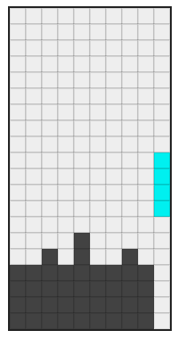

# Android Tetris Clone

A personal, offline **block-stacking game** for Android—classic handheld-style play with touch controls, built with **Kotlin** and **Jetpack Compose**.

**Try it:** **[Play in your browser](https://yorgopetsas.github.io/yetris/)** — no install; runs the same core engine as the Android app (best score stays in that browser only). The live page is refreshed when a maintainer runs **Actions → Web preview (GitHub Pages)**. For the **Android APK**, use **Actions → Android CI** → artifact **`app-debug-apk`**.

<p align="center">
  <a href="https://yorgopetsas.github.io/yetris/" title="Open Yetris in the browser">
    
  </a>
</p>

<p align="center">
  <strong>Stack · Fall · Clear · Repeat</strong>
</p>

---

## Spec-driven development

This project is developed **from specifications**, not only from ad-hoc coding:

- **Feature spec** — User stories, functional requirements, success criteria, and assumptions live in [`specs/001-android-tetris-clone/spec.md`](specs/001-android-tetris-clone/spec.md).
- **Implementation plan** — Technical context and structure: [`specs/001-android-tetris-clone/plan.md`](specs/001-android-tetris-clone/plan.md).
- **Tasks** — Dependency-ordered work items: [`specs/001-android-tetris-clone/tasks.md`](specs/001-android-tetris-clone/tasks.md).
- **Design artifacts** — Research notes, data model, and gameplay contracts under [`specs/001-android-tetris-clone/`](specs/001-android-tetris-clone/) (including [`contracts/gameplay-contract.md`](specs/001-android-tetris-clone/contracts/gameplay-contract.md)).

The repo root also contains **Spec Kit** tooling under [`.specify/`](.specify/) and Cursor rule pointers in [`.cursor/rules/specify-rules.mdc`](.cursor/rules/specify-rules.mdc), so AI-assisted workflows can stay aligned with the same documents.

**Workflow in practice**: describe the product → capture **user stories** and **requirements** in `spec.md` → plan and tasks → implement in `android/` → update specs when behavior changes.

---

## User stories (from the feature spec)

Stories are **prioritized** so the core game ships first; later stories refine UX and persistence.

| Story | Priority | Summary |
|--------|-----------|---------|
| **US1** — Core gameplay | P1 | Play sessions with falling pieces, move/rotate, line clears, game over. |
| **US2** — Scoring | P2 | In-run score that increases with line clears; visible through game over. |
| **US3** — Quick replay | P3 | Restart after game over without leaving the app; clean board on restart. |
| **US4** — Control layout | P2 | Move Left / Move Right toward screen edges; Rotate and Soft Drop grouped and centered between them. |
| **US5** — Personal best | P2 | Best score **persisted on device**; optional **display name** when you beat your previous best. |

Detailed acceptance scenarios are in [`spec.md`](specs/001-android-tetris-clone/spec.md).

---

## Piece sequence logic (tetromino RNG)

The app uses a **7-bag randomizer** (common in guideline-style Tetris):

1. Each **bag** contains **exactly one of each** of the seven tetromino types.
2. The bag is **shuffled** using a **per-session** random source (not a fixed global seed), so cold starts do not always produce the same opening sequence.
3. Pieces are drawn from the bag until it is empty, then a **new bag** is filled and shuffled again.

This keeps drops **fair** (no long droughts of one shape) and **varied** across launches. Speed and difficulty from **gravity / levels** are separate from this RNG (future tuning).

Implementation: [`PieceGenerator.kt`](android/shared/src/commonMain/kotlin/com/yorgo/tetris/game/PieceGenerator.kt) (`resetSession()` on each new game / restart from [`RestartLogic.kt`](android/shared/src/commonMain/kotlin/com/yorgo/tetris/game/RestartLogic.kt)).

---

## What this version implements (high level)

### Gameplay engine (`domain` + `game`)

- **Board grid** (10×20), **collision**, **movement / rotation**, **lock**, **line clear**, **scoring** (deterministic line-clear points), **game over** when the next piece cannot spawn.
- **Tick-driven gravity** with input between ticks; engine notifies UI on state changes.
- **Pause / resume** hooks respect lifecycle so startup is not stuck in an invalid “running without a session” state.

### UI (`ui`)

- **Jetpack Compose** board that scales to available height while keeping **10 columns × 20 rows**.
- **Controls**: one full-width row — **Left** at the start edge, **Right** at the end edge, **Rotate** and **Drop** centered in the middle ([`ControlsPanel.kt`](android/app/src/main/java/com/yorgo/tetris/ui/ControlsPanel.kt)).
- **Score panel** for current score and **best** (with **name** when saved).
- **Game over**: normal restart dialog, or **new personal best** flow with name entry / anonymous ([`GameOverDialog.kt`](android/app/src/main/java/com/yorgo/tetris/ui/GameOverDialog.kt)).

### Persistence and high scores

There are **two separate** score concepts:

| What you see | Where it lives | Synced across phone / web? |
|--------------|----------------|----------------------------|
| **Best on this device** | Android `SharedPreferences` or browser `localStorage` | **No** — each install/browser keeps its own personal best |
| **Top 10 high scores (all players)** | Google Sheet via Apps Script ([`leaderboard.gs`](specs/001-android-tetris-clone/scripts/leaderboard.gs)) | **Yes** — one shared online list when URL + token are configured |

Tap **Top 10 high scores** in the app or on the [web demo](https://yorgopetsas.github.io/yetris/) to open the popup. A new score is posted to the shared list when you beat your **local** best and save your name after game over.

**To enable the global list:** deploy `leaderboard.gs`, then set the same `LEADERBOARD_URL` and `LEADERBOARD_TOKEN` in `android/local.properties` (APK builds) and in `index.html` (`window.YETRIS_LEADERBOARD_*`) before publishing the web build.

### Improvements over the initial prototype

| Area | Earlier behavior | Current behavior |
|------|------------------|-------------------|
| **RNG** | Fixed-seed uniform random (same early pieces every launch) | **7-bag** + **per-session shuffle** |
| **Best score** | In-memory only (lost when app killed) | **Persisted** locally with optional **name** on new best |
| **Controls** | Single compact row | **Edge-aligned** left/right, **centered** rotate + drop |
| **UI / engine** | Occasional empty board / no motion edge cases | Lifecycle-safe **pause/resume**, engine **listener** updates UI on ticks |
| **Specs** | — | **User stories FR-013–FR-016**, contracts, data model updated |

---

## Tech stack

| Layer | Choice |
|--------|--------|
| Language | Kotlin |
| UI | Jetpack Compose + Material 3 |
| Min SDK | 29 (Android 10+) |
| Target / compile SDK | 35 |
| ViewModel | `AndroidViewModel` + `StateFlow` for UI state |
| Persistence | `SharedPreferences` (personal best) |

---

## Repository layout

```text
spec-kit/
├── android/                 ← Android Studio project (Gradle module `:app`)
│   ├── app/
│   ├── build.gradle.kts
│   ├── settings.gradle.kts
│   └── gradlew / gradlew.bat
├── specs/
│   └── 001-android-tetris-clone/   ← spec, plan, tasks, research, contracts, checklists
├── .specify/                ← Spec Kit tooling config (optional)
├── .cursor/                 ← Cursor rules / skills (optional)
└── README.md
```

Open **`android/`** in Android Studio as the Gradle project root.

---

## Build & run

### Prerequisites

- [Android Studio](https://developer.android.com/studio) (recommended: latest stable)
- A **JDK** compatible with the Android Gradle Plugin (often **17** or **21** depending on AGP; use the JDK bundled with Android Studio or match [`android/gradle/gradle-daemon-jvm.properties`](android/gradle/gradle-daemon-jvm.properties) if you use Gradle from the command line).
- Android SDK with API **35** if prompted.

### Run on a device or emulator

1. Open the folder **`android`** in Android Studio.  
2. Let **Gradle sync** finish.  
3. Select a device or emulator.  
4. Click **Run**.

### Command line (from `android/`)

```bash
# Windows
.\gradlew.bat assembleDebug

# macOS / Linux
./gradlew assembleDebug
```

Typical debug APK output:

`android/app/build/outputs/apk/debug/app-debug.apk`

### Are builds pushed to GitHub?

**Only what you commit** is pushed. The Gradle output folder `android/app/build/` is listed in [`.gitignore`](.gitignore), so **APKs are not uploaded as part of normal commits** unless you deliberately add them.

**Recommendation:** do **not** commit large `build/` trees or debug APKs into git (repo bloat, merge noise, binaries age quickly). Better options:

| Approach | Use when |
|----------|----------|
| **GitHub Actions artifacts** (this repo) | You want a fresh **debug APK** built on each push to `main`; users download the zip from the Actions tab. |
| **GitHub Releases** | You tag a version and attach a **release APK** (often signed) for “official” downloads. |

This repository includes [`.github/workflows/android-ci.yml`](.github/workflows/android-ci.yml): on pushes to **`main`** that touch `android/`, it runs **`assembleDebug`** and uploads **`app-debug-apk`**. The **browser preview** is optional and uses a **separate** workflow ([`.github/workflows/web-pages.yml`](.github/workflows/web-pages.yml)) so pushes are not blocked by Kotlin/JS + webpack + Pages.

**How to download the APK**

1. Open the repo on GitHub → **Actions** → select **Android CI** → latest successful run.  
2. Under **Artifacts**, download **`app-debug-apk`** (zip containing `app-debug.apk`).  
3. Copy the APK to your phone and install (you may need to allow install from unknown sources for that file manager).

Debug builds are convenient for testing; for public distribution you typically add **signing** and publish **release** builds via Play Store or signed Release APK/AAB.

### Web preview (GitHub Pages)

Gameplay logic lives in the Kotlin Multiplatform module **`android/shared`**. The **JS target** uses the same engine as Android. To **publish** the web build to GitHub Pages, run [**Web preview (GitHub Pages)**](.github/workflows/web-pages.yml) manually: **Actions** → **Web preview (GitHub Pages)** → **Run workflow**.

**One-time setup (repository owner)**

1. GitHub repo → **Settings** → **Pages** → **Build and deployment** → **Source**: **GitHub Actions** (not “Deploy from a branch”).  
2. Run **Web preview (GitHub Pages)** from the Actions tab when you want to refresh the site (not tied to every push).  
3. After a green run, open the site at **`https://<user>.github.io/<repo>/`** (for this fork: **`https://yorgopetsas.github.io/yetris/`** if the repo name stays `yetris`).

**If Actions shows `ls … dist/pages`:** that log is from an **older** workflow file. On **`main`**, open [`.github/workflows/web-pages.yml`](.github/workflows/web-pages.yml) on GitHub and confirm it contains the step **“Locate webpack output for Pages”** (not a bare `ls` on `dist/pages`). If the old step is still there, **`main` on GitHub is behind** — push or merge the latest commits from this repo.

**`android/shared/build/` on GitHub:** you will **not** see it in the file browser; **`build/` is gitignored**. It only exists on **runners** during Actions and on your PC **after** a successful Gradle web build.

Local web dev (from `android/`): `./gradlew :shared:jsBrowserDevelopmentRun` — webpack dev server with the same `index.html` under `shared/src/jsMain/resources/`.

**Web controls:** on-screen buttons plus **arrow keys** (← → move, ↑ rotate, ↓ soft drop). The canvas is rendered at 1.5× scale (270×540 px) for easier play in the browser. Configure `window.YETRIS_LEADERBOARD_URL` / `TOKEN` in [`index.html`](android/shared/src/jsMain/resources/index.html) (same values as `local.properties`) so the web demo uses the same global top-10 list as Android.

---

## Controls (current version)

| Control | Action |
|---------|--------|
| **Left** | Move active piece left (start edge of control row) |
| **Right** | Move active piece right (end edge of control row) |
| **Rotate** | Rotate when placement is valid (center, with Drop) |
| **Drop** | Soft drop (center, with Rotate) |
| **Web: arrow keys** | ← → move, ↑ rotate, ↓ soft drop (browser preview only) |

---

## Contributing / evolving the spec

When you change gameplay or UX meaningfully:

1. Update [`spec.md`](specs/001-android-tetris-clone/spec.md) (and optionally `plan.md`, `contracts/`, `data-model.md`).
2. Adjust [`tasks.md`](specs/001-android-tetris-clone/tasks.md) or add follow-up tasks.
3. Implement in `android/` and keep this README in sync for major behavior changes.

---

## License

Personal project unless you add an explicit license file.  
If you open-source this repo, add a `LICENSE` (e.g. MIT) and update this section.

---

<p align="center">
  Made for quick sessions on a phone—no accounts, no servers, just blocks.
</p>
